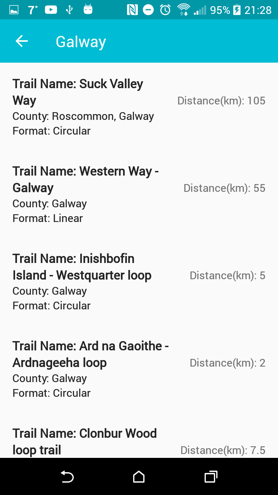

# WalkPal

An Android application for walkers in Ireland. It is an all in one Irish walk guide that includes walk details, directions, images, near by services, terrain , elevation and weather updates for each walk, allowing users to plan accordingly for their day out.

## Home Screen

## Trail List

## Walk Details


The App uses information from a dataset that was got from Sports Ireland.  https://www.sportireland.ie/

```JSON
[
    {
        "_id": {
            "$oid": "5a84b007755128a5fe58d2cf"
        },
        "Trail ID": 1129,
        "Trail Name": "Athy Sl?",
        "County": "Kildare",
        "Category": 7,
        "Quality": "",
        "Type": "Sli Route",
        "Format": "Circular",
        "Length (Km)": 2.6,
        "Climb (m)": "",
        "Grade": "Easy",
        "Estimated time to complete (mins)": 30,
        "Dogs Allowed": 1,
        "Description of Waymarking": "",
        "Nearest Town to Start": "Athy",
        "Start Point": "",
        "Start Point\n Grid reference": "",
        "Finish point": "",
        "Finish point\nGrid reference": "",
        "Nearest Town to Finish": "",
        "Start Latitute": 52.992006,
        "Start Longitude": -6.983957
    }
]
```

[Paul Butler](https://www.linkedin.com/in/paul-butler-90b322143/)

Email: c14521457@mydit.ie
